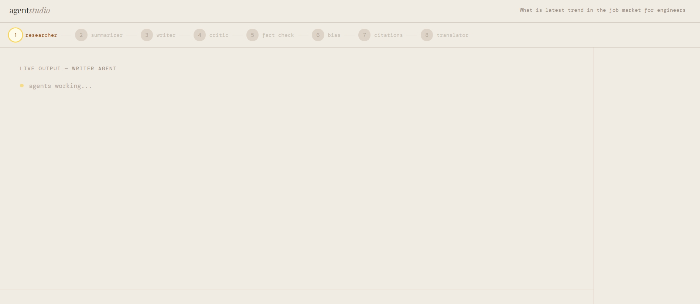
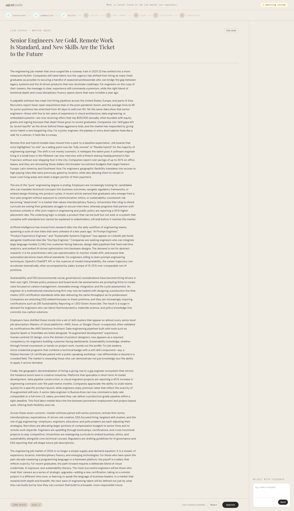
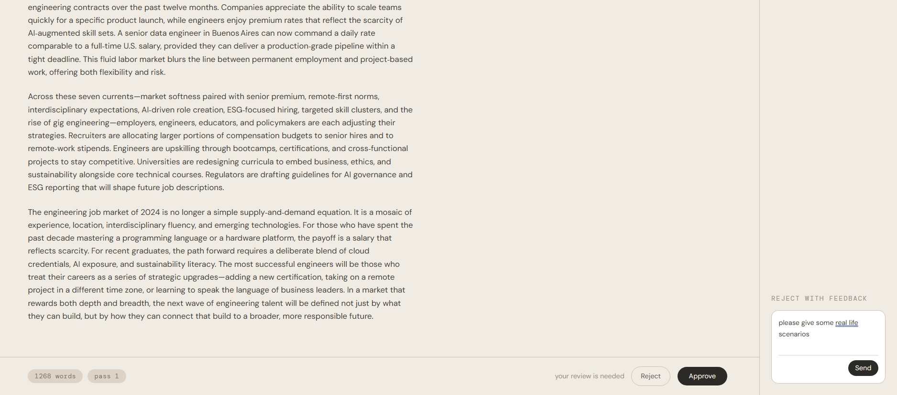
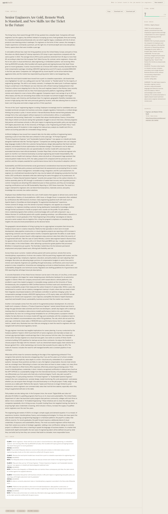

# agentstudio

A multi-agent AI research system built on **LangGraph**, with a real-time streaming UI, human-in-the-loop review, and export to Markdown/PDF. Give it a topic, and eight specialist agents research, write, fact-check, bias-check, cite, and translate a full article — with a human able to approve, edit, or reject the draft mid-pipeline.

**Live demo:** [agentstudio-yhm9.onrender.com](https://agentstudio-yhm9.onrender.com) *(hosted on Render's free tier — the first request after a period of inactivity may take 30-60s to wake up)*


---

## Demo

**Home — start a run, browse history**


**Live run — agents working through the pipeline**


**Human review — approve, edit, or reject the draft**


**Rejecting with feedback that goes straight back to the Writer**


**Final output — scored, fact-checked, cited**


---

## What it does

1. **Enter a topic** and pick an output language (English, Hindi, French, Spanish, Japanese).
2. **Eight agents run in sequence**, each visible live as it completes:
   - **Researcher** — pulls grounding data from DuckDuckGo and arXiv
   - **Summarizer** — condenses raw research into key points
   - **Writer** — drafts the article, streamed token-by-token to the UI
   - **Critic** — scores the draft and routes it back to the Writer for revision if it scores below threshold (capped at 3 revision passes)
   - **Fact Checker** — cross-references claims against Wikipedia
   - **Bias Detector** — flags one-sided framing or loaded language
   - **Citation Builder** — formats every source used into a clean citation list
   - **Translator** — translates the final piece if a non-English language was chosen
3. **Human review**: before the Critic runs, the pipeline pauses and hands control to you — approve as-is, edit the draft directly, or reject with written feedback that goes straight back to the Writer.
4. **Export**: copy the article, download as Markdown, or download a styled PDF (rendered from the actual page — same fonts, same layout, works for any language/script).
5. **Run history**: every completed run is saved with its score, source count, and token usage, browsable from the home page.

---

## What I applied

**Backend**
- **LangGraph** `StateGraph` for orchestrating 8 agents with conditional edges and a genuine cycle (Writer ↔ Critic revision loop, capped to prevent infinite loops)
- **Human-in-the-loop interrupts** (`interrupt_before`) combined with `update_state(..., as_node=...)` to inject human feedback into the graph without it being silently overwritten by the next node's own output
- **FastAPI + WebSockets** for real-time, bidirectional streaming of agent progress and token-by-token writer output
- **Async/threading bridge**: agent nodes make blocking LLM and HTTP calls, so the whole graph execution runs in a worker thread (`asyncio.to_thread`) with results routed back to the event loop via `run_coroutine_threadsafe` — keeps the server responsive to new connections while a run is in progress
- **LangChain + OpenRouter** for LLM access, with retry/backoff on transient failures and real token-usage tracking pulled from the API response
- **SQLite** for run history persistence
- **pytest** unit tests covering graph routing logic, the human-feedback mechanism, storage, and API endpoints (with mocked LLM calls)

**Frontend**
- **React 18 + Vite + Tailwind CSS**
- **react-markdown + remark-gfm** for rendering LLM-authored Markdown (headings, bold/italic, GFM tables) instead of dumping raw text
- **Client-side PDF export** via `html2canvas` + `jsPDF`: rasterizes the actual rendered page (so it matches the site's styling and supports any language/script, not just Latin text), with custom pagination logic that detects blank rows between paragraphs so page breaks never land mid-sentence

**Infra**
- Multi-stage **Docker** build (Node build stage → Python runtime stage) so a single container serves both the API and the built frontend
- Deployed on **Render**, reading the platform-assigned `$PORT` at runtime

---

## What I learned

- **State machines aren't just for simple flows.** Getting the reject-and-revise loop right meant understanding exactly how LangGraph's checkpointer applies partial state updates — the naive approach (just resuming after writing feedback into state) silently discarded the human's input the moment the next node ran, because that node's own return value overwrote the same keys. The fix (`as_node="critic"`) took real digging into LangGraph's execution model to find.
- **Never block the event loop.** Early versions had the whole server freeze mid-run because synchronous LLM/search calls ran directly on the async event loop. Diagnosing and fixing this (moving execution to a worker thread, bridging back via `run_coroutine_threadsafe`) taught me a lot about how async Python actually schedules work under the hood.
- **Rasterized PDF export has real gotchas.** `html2canvas` silently renders `opacity: 0` elements as blank (correct dimensions, zero actual pixels) — which caused genuinely blank PDF downloads that took careful pixel-level debugging to catch, since the file size and canvas dimensions all looked correct. It also doesn't reliably capture native CSS list markers (`::marker`), which meant building list numbering manually as real DOM elements instead of relying on `list-style`.
- **Deployment platforms aren't interchangeable.** Serverless platforms like Vercel are a poor fit for anything with WebSockets, long-running background work, or in-memory state — understanding *why* (execution time limits, statelessness between invocations) shaped the decision to deploy on a platform built for long-running containers instead.
- **Diagnosing environment issues, not just code issues.** A corporate network's TLS-inspecting root CA caused every outbound HTTPS call to fail with `CERTIFICATE_VERIFY_FAILED` — fixed by merging the Windows trust store into the CA bundle at startup, without needing any new dependencies.

---

## Running it locally

```bash
git clone https://github.com/Sachi1312/agentstudio.git
cd agentstudio
```

Create a `.env` file with:
```
OPENROUTER_API_KEY=your_key_here
```

**Option A — one command (build once, then just run the server):**
```bash
cd frontend && npm install && npm run build && cd ..
python -m venv venv && venv\Scripts\activate  # or source venv/bin/activate on Mac/Linux
pip install -r backend/requirements.txt
python -m uvicorn backend.main:app --port 8000
```
Open http://localhost:8000

**Option B — Docker:**
```bash
docker compose up
```

**Option C — active frontend development (hot reload):**
```bash
# terminal 1
python -m uvicorn backend.main:app --port 8000
# terminal 2
cd frontend && npm install && npm run dev
```
Open http://localhost:5173

---

## Tests

```bash
pip install -r backend/requirements-dev.txt
pytest backend/tests/
```
Built by — [Sachi1312](https://github.com/Sachi1312).